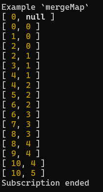

# Very Simple Observable

Features supported

- Create an observable
    - `of`
    - `from`
    - `interval`
- Subscribing/Unsubscribing
- Piping with
    - `map`
    - `filter`
    - `mergeMap`

## mergeMap

Example on 2 intervals

`
const interval100$ = interval(100, 10);
const interval200$ = interval(200, 5);

interval100$.pipe([mergeMap(interval200$)])
`

